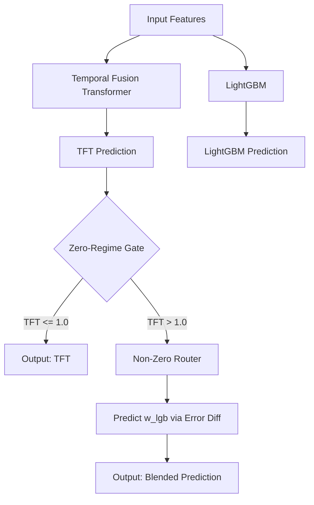

# CRAFT: Contextual Routing for Adaptive Forecasting of Time-series

**M5 Forecasting Accuracy Hackathon Submission**

CRAFT (Contextual Routing for Adaptive Forecasting of Time-series) is a hybrid modeling architecture designed specifically for the extreme zero-inflation found in retail time-series data. It employs a **Zero-Inflated Gating Network** to intelligently route predictions between a conservative baseline (Temporal Fusion Transformer) and an aggressive regressor (LightGBM) depending on the stability and demand state of the series.

## Features & Deliverables

This repository contains our complete submission package:
1. **Pluggable Benchmarking Codebase:** A robust framework (`m5_framework/`) for evaluating any hybrid model with automated 95% Confidence Intervals via bootstrapping.
2. **Benchmark Results Table:** Found in `outputs/benchmark_results_with_ci.csv` and summarized in our analysis.
3. **Written Analysis:** A deep dive into performance across stable and volatile regimes (`ANALYSIS.md`).
4. **Interactive Dashboard:** A Flask-based visualizer for contextual model inspection and historical tracking (`dashboard/`).

## Architecture Diagram



## Reproducibility Guide

Follow these steps to reproduce our results from scratch.

### 1. Environment Setup
We recommend using conda to manage dependencies.

```bash
conda create -n craft_env python=3.10 -y
conda activate craft_env
pip install -r requirements.txt
```

### 2. Data Preparation
Ensure the M5 dataset files from Kaggle are in the root directory:
- `calendar.csv`
- `sell_prices.csv`
- `sales_train_validation.csv`
- `sales_train_evaluation.csv`

### 3. Training the Base Models
First, train the individual base models to generate intermediate predictions in `outputs/`.

```bash
# 1. Train LightGBM model
python train_lgb.py

# 2. Train Temporal Fusion Transformer (TFT)
python train_tft.py
```
*(Note: TFT training utilizes PyTorch Lightning and may take some time depending on your hardware.)*

### 4. Training the Zero-Inflated Gating Network
Train the adaptive gating pipeline to optimize the zero threshold and train the secondary LightGBM router.

```bash
python train_zi_gate.py
```
This generates the fused CRAFT predictions and saves them to `outputs/craft_predictions.csv`.

### 5. Running the Standardized Benchmark
Run the evaluation framework to compute metrics (MAE, RMSSE, MASE) across Stable/Volatile regimes with 95% bootstrapped confidence intervals.

```bash
python run_benchmark.py
```
Results will be output to the console and saved to `outputs/benchmark_results_with_ci.csv`.

### 6. Interactive Dashboard
Launch the contextual inference dashboard to visualize the forecasting behavior and regime switches visually:

```bash
python dashboard/app.py
```
Navigate to `http://127.0.0.1:5001` in your browser.

## File Structure
- `m5_framework/`: Pluggable model wrappers and the bootstrapping evaluator.
- `dashboard/`: Flask backend and Vanilla HTML/CSS/JS frontend for visualization.
- `train_*.py`: Model training scripts.
- `ANALYSIS.md`: Detailed performance analysis and regime breakdowns.
- `outputs/`: Cached predictions, benchmark CSVs, JSON metrics, and SHAP interpretability plots.
